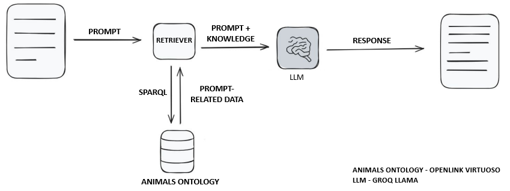

# animals-chatbot

## Goal

This project is a chatbot designed to provide information about animals, including their characteristics, habitats, and classification into taxonomic groups. It is intended as an educational tool for preschool and school-aged children who are interested in learning more about the animal kingdom in an accessible and engaging way.

## Animal Ontology
This ontology defines a structured representation of animal-related knowledge. It models key biological and ecological aspects of animals, including their taxonomy, characteristics, and habitats.

The ontology consists of the following components:

- Classes:

    - Animal - Represents an individual animal instance
    - Characteristics - Holds detailed biological and ecological data about an animal
    - Location - Geographical data for animal habitat

- Taxonomic levels: Kingdom, Phylum, Class, Order, Family, Genus, Scientific_name

- Object Properties:

    - belongsTo: Links taxonomic entities across classification levels

    - hasScientificName: Connects an Animal to its Scientific_name

    - hasCharacteristics: Associates an Animal with its Characteristics

    - livesIn: Specifies the Location where an Animal lives

- Datatype Properties (associated mostly with Characteristics):

    - Include attributes such as diet, color, lifespan, gestation_period, top_speed, prey, skin_type, and many others, all represented as xsd:string literals

#### Purpose
This ontology is designed to facilitate semantic reasoning and structured querying of animal-related information. It provides a framework for organizing biological data to enable efficient and precise querying using RDF queries.

## Populating ontology

For populating ontology we created Python script which purpose is to enrich an animal ontology RDF graph by integrating  biological data retrieved from the API Ninjas Animals . Starting with a base empty ontology, it queries the API for each animal from predifined list of top 100 interesting animals. The returned JSON data contains taxonomy (kingdom, phylum, class, order, family, genus, scientific name), geographical locations, and various characteristics. The script then applies a sophisticated logic to systematically transform this hierarchical and descriptive data into structured RDF triples using the rdflib library. It models relationships such as taxonomic hierarchy (belongsTo), animal characteristics, and habitats. The final populated ontology is serialized into a new RDF file which will be used to query data

### Steps to Generate Animal RDF Ontology

1. **Load the base RDF ontology file** - Use rdflib.Graph() to create an RDF graph and load the initial empty animal ontology from the RDF/XML file.

2. **Define custom namespaces** - Define the custom namespace for your animal ontology to structure the RDF data consistently.

3. **Create URIs and add taxonomy hierarchy** - For each animal, create URIs for the animal and its taxonomic ranks (kingdom, phylum, class, order, family, genus, scientific name). Add RDF triples that represent their types and hierarchical belongsTo relationships to reflect biological taxonomy.

4. **Add animal-specific data** - Add triples for the animal’s scientific name, geographical locations (habitats), and other biological characteristics, linking them appropriately to the animal entity in the graph.

5. **Handle properties with clean identifiers** - Sanitize property keys (e.g., remove special characters) when converting JSON characteristics to RDF predicates to ensure valid URIs in the ontology.

6. **Serialize and save the populated ontology**
After all animals are processed, serialize the RDF graph back into an RDF/XML file (mega_populated_ontology.rdf) for future semantic queries and reasoning.

## Backend
The backend of this application is built with FastAPI and integrates semantic technologies to enable natural language question answering over an RDF animal ontology. It communicates with a Virtuoso SPARQL endpoint to fetch and query RDF data, which is dynamically loaded into a temporary RDF graph. This graph is used in alongside LLM (OpenAI GPT-4o) to interpret user queries and translate them into SPARQL. The result of each query is processed and returned as a human-readable answer. LangChain's SparqlQAChain class is central to this architecture, acting as a bridge between the user's natural language input and the RDF-based knowledge graph.
Chain flow is described in following steps:
1. **Ontology Loading and Graph Construction**
At startup, the application queries the RDF data from a Virtuoso SPARQL endpoint using SPARQLWrapper. It performs a CONSTRUCT query to fetch all triples from the ontology and saves the result to a temporary RDF file. This file is then loaded into an in-memory RDF graph using LangChain’s RdfGraph interface.

2. **User Query Submission**
Users submit free-form questions (e.g., “Where do lions live?”) through an HTTP POST request to the backend.

3. **SPARQL Query Generation with LLM**
The system uses LangChain’s LLM pipeline to prompt the GPT-4o model with a structured template and the ontology schema. The model responds with a dynamically generated SPARQL SELECT query that matches the user’s intent and the data structure of the RDF graph.

4. **Query Execution**
The generated SPARQL query is executed against the Virtuoso endpoint, and the matching RDF data is retrieved in JSON format.

5. **Answer Construction**
The original question and the query result are passed back to the GPT-4o model, which generates human-understandable answer using another prompt. This process transforms raw RDF response and displays it to users through natural language

6. **Returning the Result**
The answer is returned to the frontend as a JSON object

## Frontend
The frontend is a simple web interface served using Jinja2 templates. It allows users to input natural language questions about animals (e.g., “Where does a lion live?”), which are then sent to the backend for processing.

## Authors
 - Bojan Mijanović R2 3/2024
 - Vukašin Bogdanović R2 12/2024
 - Jovan Jokić R2 19/2024